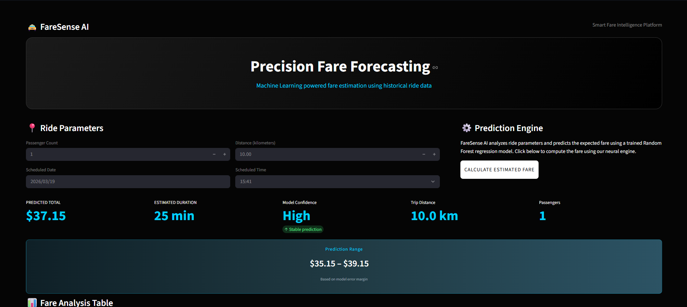
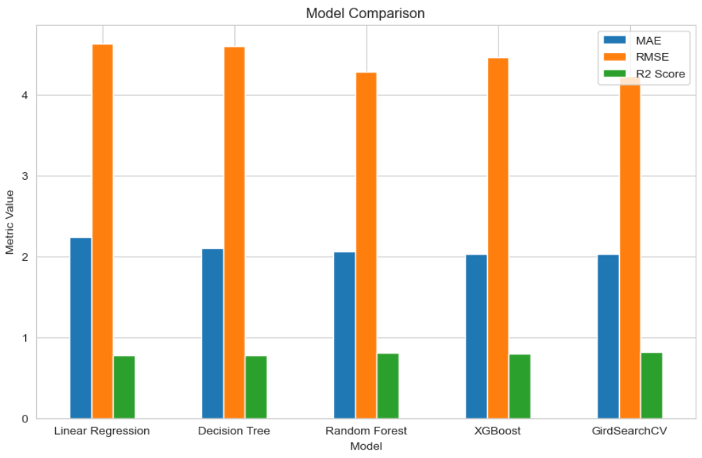

# FareSense AI 🚖
## Smart Fare Intelligence using Machine Learning


FareSense AI is an end-to-end Machine Learning project that predicts Uber ride fares using historical ride data. This project demonstrates a complete ML workflow including data preprocessing, feature engineering, model training, evaluation, and deployment using Streamlit.

---

## Project Overview

This project develops a regression-based machine learning system to estimate ride fares based on ride characteristics such as:

• Distance travelled  
• Passenger count  
• Pickup date and time  
• Ride behavior patterns  

The objective is to demonstrate how machine learning can be applied to real-world pricing prediction problems.

---

## 📊 Dataset Description

The dataset contains historical Uber ride information including:

• Fare amount (target variable)  
• Pickup coordinates  
• Dropoff coordinates  
• Pickup datetime  
• Passenger count  

Total Records: ~193,000 rides

The dataset represents urban ride behavior.

---

## Key Features

✔ End-to-end ML pipeline  
✔ Data cleaning and preprocessing  
✔ Feature engineering  
✔ Exploratory Data Analysis (EDA)  
✔ Multiple regression models  
✔ Hyperparameter tuning using GridSearchCV  
✔ Model comparison and evaluation  
✔ Feature importance analysis  
✔ Model explainability insights  
✔ Interactive Streamlit prediction app  

---

## System Architecture

The FareSense AI system follows a modular machine learning architecture from data ingestion to deployment.

### Architecture Flow

Dataset  
↓  
Data Cleaning & Preprocessing  
↓  
Feature Engineering  
↓  
Exploratory Data Analysis  
↓  
Model Training & Comparison  
↓  
Hyperparameter Tuning  
↓  
Model Evaluation  
↓  
Model Serialization (Joblib)  
↓  
Streamlit Application  
↓  
User Fare Prediction Interface

---

## Architecture Diagram

                    ┌─────────────────────┐
                    │   Uber Dataset      │
                    │ Historical Rides    │
                    └─────────┬───────────┘
                              │
                              ▼
                    ┌─────────────────────┐
                    │ Data Preprocessing  │
                    │ Cleaning & Handling │
                    └─────────┬───────────┘
                              │
                              ▼
                    ┌─────────────────────┐
                    │ Feature Engineering │
                    │ Distance, Time      │
                    └─────────┬───────────┘
                              │
                              ▼
                    ┌─────────────────────┐
                    │ Exploratory Data    │
                    │ Analysis (EDA)      │
                    └─────────┬───────────┘
                              │
                              ▼
                    ┌─────────────────────┐
                    │ Model Training      │
                    │ RF, XGBoost, DT     │
                    └─────────┬───────────┘
                              │
                              ▼
                    ┌─────────────────────┐
                    │ Hyperparameter      │
                    │ Tuning              │
                    └─────────┬───────────┘
                              │
                              ▼
                    ┌─────────────────────┐
                    │ Best Model Selected │
                    │ Random Forest       │
                    └─────────┬───────────┘
                              │
                              ▼
                    ┌─────────────────────┐
                    │ Model Serialization │
                    │ joblib (.pkl files)│
                    └─────────┬───────────┘
                              │
                              ▼
                    ┌─────────────────────┐
                    │ Streamlit App       │
                    │ Prediction UI       │
                    └─────────┬───────────┘
                              │
                              ▼
                    ┌─────────────────────┐
                    │ Fare Prediction     │
                    │ User Interface      │
                    └─────────────────────┘

## Models Implemented

The following regression models were trained and evaluated:

• Linear Regression  
• Decision Tree Regression  
• Random Forest Regression  
• XGBoost Regression  

Among these, **Random Forest Regression** provided the best overall performance.

---

## Model Performance

| Model | MAE | RMSE | R² Score |
|------|------|------|------|
| Linear Regression | 2.24 | 4.63 | 0.77 |
| Decision Tree | 2.10 | 4.59 | 0.78 |
| Random Forest | 2.03 | 4.23 | **0.81** |
| XGBoost | 2.02 | 4.46 | 0.79 |

Best Model: **Random Forest Regression**

---
## 🛠️ Technologies Used

* **Python**
* **Pandas**
* **NumPy**
* **Scikit-learn**
* **Matplotlib**
* **Seaborn**
* **Streamlit**
* **Joblib**

---

## 📁 Project Structure

```
FareSense-AI/
│
├── notebooks/
│   └── Fare_Prediction.ipynb
│
├── app.py
│
├── models/
│   ├── fare_model.pkl
│   └── scaler.pkl
│
├── requirements.txt
├── README.md
└── .gitignore
```

---

## 🚀 How to Run the Project

### 1️⃣ Clone the Repository

```bash
git clone https://github.com/shashank-g2100/FareSense-AI-Fare-Prediction.git
cd FareSense-AI-Fare-Prediction
```

### 2️⃣ Install Dependencies

```bash
pip install -r requirements.txt
```

### 3️⃣ Run the Streamlit Application

```bash
streamlit run app/streamlit_app.py
```

---

## 🌐 Application Interface

Once the app runs, open your browser and navigate to:

```
http://localhost:8501
```

You can enter trip details such as **distance, time, and other parameters** to get a predicted fare.

---

## 📸 Application Preview

### Prediction Dashboard


### Model Analysis


---

## 📊 Features

* Data preprocessing and feature engineering
* Machine learning model for fare prediction
* Model evaluation and visualization
* Interactive **Streamlit web application**
* Scalable and modular project structure

---

## Key Insights from Analysis

• Most Uber rides occur within short distances (below 5 km)  
• Distance is the strongest predictor of fare amount  
• Passenger count has minimal impact on pricing  
• Time-based features moderately influence pricing  
• Model performs best within typical ride ranges (0–60 km)

---

## Model Limitations

• Dataset heavily skewed toward short-distance rides  
• Limited samples for long-distance trips  
• Surge pricing and traffic data not included  
• Predictions beyond common ride ranges may be less reliable  

---

## Future Improvements

Possible improvements to enhance the system:

• Add surge pricing prediction  
• Include traffic data  
• Integrate weather information  
• Try Gradient Boosting / LightGBM  
• Deploy REST API  
• Add real-time prediction capability  

---

## Deployment

The trained Random Forest model was deployed using Streamlit to create an interactive fare prediction system.

The application allows users to input ride parameters and receive instant fare predictions, demonstrating an end-to-end ML deployment workflow.

---

## What I Learned

Through this project I gained practical experience in:

• Data preprocessing techniques  
• Feature engineering strategies  
• Regression model training  
• Hyperparameter tuning  
• Model evaluation metrics  
• ML deployment using Streamlit  
• Building explainable ML systems  

---

## Conclusion

This project successfully demonstrates how machine learning can be used to build a fare prediction system using historical ride data.

Random Forest Regression achieved the best performance with an R² score of approximately **0.81** and low prediction error.

The project covers the complete machine learning lifecycle from data preprocessing to deployment and showcases how ML models can be integrated into real-world prediction systems.

---

## Author

**Shashank G**

Machine Learning Enthusiast  
Software Engineering Aspirant  

GitHub: https://github.com/shashank-g2100

---

## License

This project is created for educational and portfolio purposes.